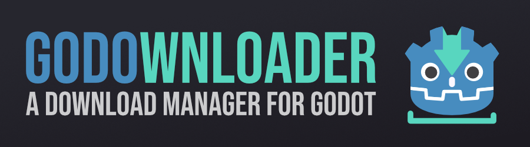

  

A Godot download manager: easily manage, download and update your Godot installations.

*NOTE: This app is currently under development!*

## About me

Full time indie gamedev: 3D, 2D & VR. 

- [Discord](https://discord.gg/83nFRPTP6t)
- [YouTube](https://www.youtube.com/c/MrEliptik)
- [TikTok](https://www.tiktok.com/@mreliptik)
- [Twitter](https://twitter.com/mreliptik_) 
- [Instagram](https://www.instagram.com/_mreliptik)
- [Itch.io](https://mreliptik.itch.io/)
- [Sketchfab](https://sketchfab.com/victor.meunierpk)

## LICENSE & Credits

This project is distributed under the MIT license, which it's free to use, modify and redistribute, for both personnal and commercial projects. For more information see [LICENSE.md](https://github.com/MrEliptik/godownloader/blob/master/LICENSE).
